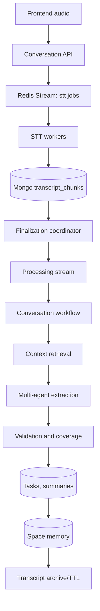
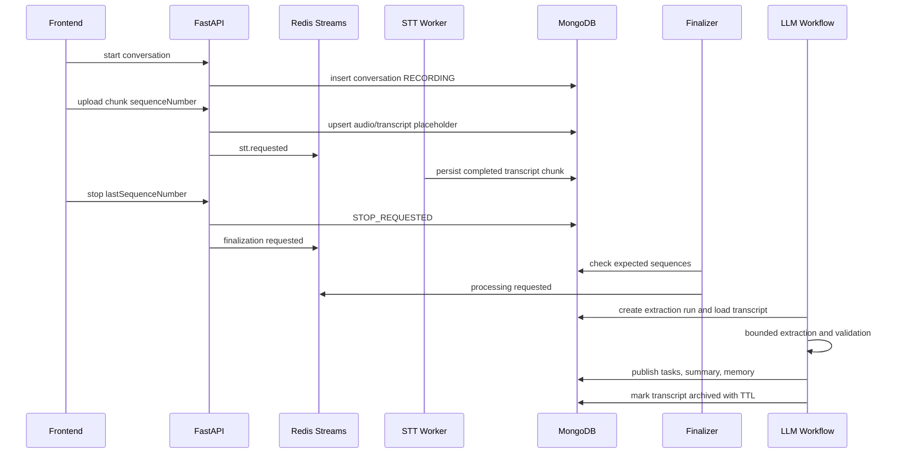

# Buddy Conversation Processing Service

Production-oriented flow:

```text
Frontend audio -> Conversation API -> Redis Streams -> STT worker
-> MongoDB ordered transcripts -> finalization coordinator
-> bounded multi-agent extraction workflow -> validation
-> tasks/summaries/space memory -> transcript retention
```

The older speech-to-vector endpoints remain available at `/api/v1/speech/*`.

## Conversation API

```powershell
POST /api/v1/conversations/start
POST /api/v1/conversations/{conversationId}/audio
POST /api/v1/conversations/{conversationId}/stop
GET  /api/v1/conversations/{conversationId}/status
```

Raw transcript chunks are stored in MongoDB as the source of truth and sorted by
`conversationId + sequenceNumber`. Qdrant is used only for semantic memory and
retrieval, never to reconstruct a full conversation.

## Redis Streams

Streams:

```text
buddy:audio:ingestion
buddy:stt:jobs
buddy:transcript:ready
buddy:conversation:finalization
buddy:conversation:processing
buddy:conversation:retry
buddy:dead-letter
```

Consumer groups:

```text
audio-workers
stt-workers
transcript-workers
finalization-workers
conversation-processing-workers
```

Events use a standard envelope with `eventId`, `correlationId`,
`conversationId`, `userId`, `spaceId`, payload, attempt, and timestamps.
Workers acknowledge only after durable database writes succeed.

## State Machine

```text
RECORDING -> STOP_REQUESTED -> WAITING_FOR_TRANSCRIPTS
WAITING_FOR_TRANSCRIPTS -> READY_FOR_PROCESSING -> PROCESSING -> VALIDATING -> COMPLETED
WAITING_FOR_TRANSCRIPTS -> PARTIAL -> PROCESSING
Any retryable stage -> RETRY_PENDING
Terminal failure -> FAILED
```

Invalid transitions are rejected by the repository before atomic Mongo updates.

## Data Model And Indexes

MongoDB collections:

```text
conversations
audio_chunks
transcript_chunks
extraction_runs
tasks
conversation_summaries
space_memory
```

Important indexes include:

```text
transcript_chunks: conversationId + sequenceNumber unique
transcript_chunks: conversationId + sttStatus
transcript_chunks: conversationId + processingStatus
transcript_chunks: expiresAt TTL
conversation_summaries: conversationId unique
space_memory: userId + spaceId unique
extraction_runs: conversationId + processingVersion unique
tasks: fingerprint unique sparse
```

## LLM Providers

Agents depend on `LLMProvider`, not OpenAI-specific clients. Sarvam is the
default provider through its OpenAI-compatible chat-completions endpoint.
Provider and model routing are capability-based and configured through env vars.

## Worker Commands

Run all workers locally:

## Run

```powershell
uvicorn apps.api_gateway.main:app --reload
```

```powershell
python -m apps.api_gateway.workers.main
```

For separate deployments, run `apps.api_gateway.workers.conversation_workers`
consumers independently by importing `build_stt_consumer`,
`build_finalization_consumer`, or `build_processing_consumer` in a small runner.

## Diagrams





## Required Environment

Use `.env.example` as the source of truth. It includes Redis Streams, MongoDB,
Sarvam, OpenAI-compatible fallback, Qdrant, retention, worker, and LLM routing
settings. Do not commit secrets.

## Migration

1. Install `requirements.txt`.
2. Add `MONGODB_URL` and `MONGODB_DATABASE`.
3. Start the API once to create MongoDB indexes, or run `ensure_mongo_indexes()`
   from `services.db.mongo` in a migration runner.
4. Deploy workers independently for STT, finalization, processing, retry relay,
   and inactivity scanning as load grows.

## Scaling Notes

API containers and worker containers are stateless. Scale STT, finalization, and
conversation-processing workers independently based on Redis stream lag,
pending-message count, provider latency, and dead-letter rate. LLM calls are
bounded globally and per conversation through configuration.
