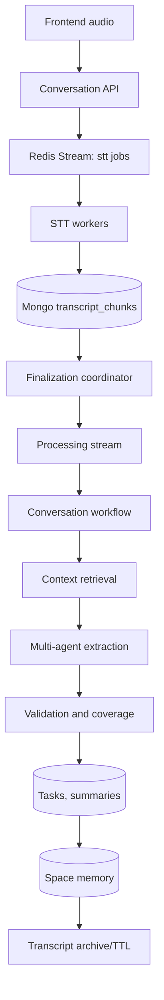
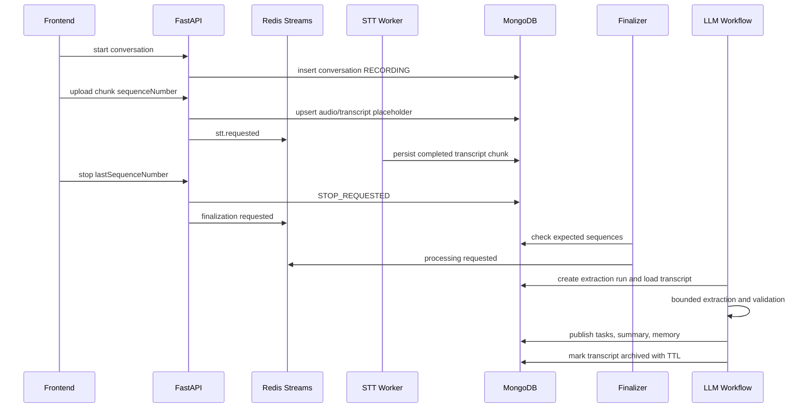

# Buddy Conversation Processing Service

## for worker -> python -m apps.api_gateway.workers.main 

## run pub sub architecture ->>uvicorn apps.api_gateway.workers.http_app:app --host 0.0.0.0 --port 8081

## Pub/Sub queue transport

Redis is still supported for local migration and for status/session state. Set
`QUEUE_PROVIDER=pubsub` to replace Redis queue publishing with Google Cloud
Pub/Sub while keeping existing processing functions unchanged.

## S3 audio transport

When API and worker run in separate Cloud Run containers, local audio paths are
not shared. Set `STORAGE_PROVIDER=s3` so the API uploads temporary audio to S3,
Pub/Sub carries only S3 metadata, and the worker downloads the object to
`/tmp/buddy/<job_id>/` before calling the existing speech-to-text function.

Required and optional settings:

```text
STORAGE_PROVIDER=s3
AWS_ACCESS_KEY_ID=
AWS_SECRET_ACCESS_KEY=
AWS_REGION=ap-south-1
S3_AUDIO_BUCKET=
S3_AUDIO_PREFIX=buddy/audio
S3_DELETE_AFTER_PROCESSING=false
S3_UPLOAD_TIMEOUT_SECONDS=60
S3_DOWNLOAD_TIMEOUT_SECONDS=60
S3_MAX_RETRIES=3
CLOUDFRONT_URL=
CLOUDFRONT_KEY_PAIR_ID=
CLOUDFRONT_PRIVATE_KEY=
CLOUDFRONT_SIGNED_URL_EXPIRES_SECONDS=3600
```

Legacy Kariyana-style credential names remain supported:

```text
ACCESS_KEY_ID=
SECREATE_KEY_ACCESS=
```

`AWS_ACCESS_KEY_ID` and `AWS_SECRET_ACCESS_KEY` take precedence over the legacy
names. CloudFront configuration is supported for generated object URLs, but the
worker uses private S3 SDK downloads and does not depend on CloudFront for
internal audio transport.

Minimum IAM:

```text
API:    s3:PutObject, s3:AbortMultipartUpload
Worker: s3:GetObject
Worker: s3:DeleteObject only when S3_DELETE_AFTER_PROCESSING=true
```

Use resource placeholders such as:

```text
arn:aws:s3:::YOUR_BUCKET
arn:aws:s3:::YOUR_BUCKET/buddy/audio/*
```

Recommended lifecycle rule: expire `buddy/audio/*` objects after 1-7 days.

Run the API locally:

```powershell
uvicorn apps.api_gateway.main:app --reload --host 0.0.0.0 --port 8000
```

Run the Pub/Sub push worker locally:

```powershell
$env:PUBSUB_VERIFY_PUSH_AUTH="false"
uvicorn apps.api_gateway.workers.http_app:app --host 0.0.0.0 --port 8080
```

Simulate a push request:

```powershell
python scripts/send_test_pubsub_message.py --endpoint http://localhost:8080/pubsub/speech --event-type speech.transcription.requested --payload '{"job_id":"local-job","user_id":"user_1","space_id":"space_1","storage_provider":"s3","s3_bucket":"YOUR_BUCKET","s3_object_key":"buddy/audio/user_1/space_1/no-session/local-job/local.wav","filename":"local.wav","content_type":"audio/wav","status":"queued"}'
```

Build the shared image:

```powershell
docker build -t <region>-docker.pkg.dev/<project>/<repo>/buddy-api:<tag> .
```

Enable Google Cloud APIs:

```powershell
gcloud services enable run.googleapis.com pubsub.googleapis.com artifactregistry.googleapis.com
```

Create Pub/Sub topics:

```powershell
gcloud pubsub topics create <speech-topic>
gcloud pubsub topics create <vector-topic>
gcloud pubsub topics create <orchestration-topic>
gcloud pubsub topics create <dead-letter-topic>
```

Deploy the API service:

```powershell
gcloud run deploy <api-service> --image <region>-docker.pkg.dev/<project>/<repo>/buddy-api:<tag> --region <region> --allow-unauthenticated --set-env-vars QUEUE_PROVIDER=pubsub,GOOGLE_CLOUD_PROJECT=<project>,PUBSUB_SPEECH_TOPIC=<speech-topic>,PUBSUB_VECTOR_TOPIC=<vector-topic>,PUBSUB_ORCHESTRATION_TOPIC=<orchestration-topic>
```

Deploy the authenticated worker service:

```powershell
gcloud run deploy <worker-service> --image <region>-docker.pkg.dev/<project>/<repo>/buddy-api:<tag> --region <region> --no-allow-unauthenticated --command uvicorn --args apps.api_gateway.workers.http_app:app,--host,0.0.0.0,--port,8080 --set-env-vars QUEUE_PROVIDER=pubsub,GOOGLE_CLOUD_PROJECT=<project>,PUBSUB_VERIFY_PUSH_AUTH=true,PUBSUB_WORKER_AUDIENCE=<worker-url>
```

Create the Pub/Sub push service account and IAM bindings:

```powershell
gcloud iam service-accounts create <pubsub-push-sa> --display-name "Pub/Sub push invoker"
gcloud run services add-iam-policy-binding <worker-service> --region <region> --member serviceAccount:<pubsub-push-sa>@<project>.iam.gserviceaccount.com --role roles/run.invoker
gcloud pubsub topics add-iam-policy-binding <speech-topic> --member serviceAccount:<api-runtime-sa>@<project>.iam.gserviceaccount.com --role roles/pubsub.publisher
gcloud pubsub topics add-iam-policy-binding <vector-topic> --member serviceAccount:<api-runtime-sa>@<project>.iam.gserviceaccount.com --role roles/pubsub.publisher
gcloud pubsub topics add-iam-policy-binding <orchestration-topic> --member serviceAccount:<api-runtime-sa>@<project>.iam.gserviceaccount.com --role roles/pubsub.publisher
```

Create push subscriptions:

```powershell
gcloud pubsub subscriptions create <speech-sub> --topic <speech-topic> --push-endpoint <worker-url>/pubsub/speech --push-auth-service-account <pubsub-push-sa>@<project>.iam.gserviceaccount.com --push-auth-token-audience <worker-url> --dead-letter-topic <dead-letter-topic> --max-delivery-attempts <max-attempts> --ack-deadline 600
gcloud pubsub subscriptions create <vector-sub> --topic <vector-topic> --push-endpoint <worker-url>/pubsub/vector --push-auth-service-account <pubsub-push-sa>@<project>.iam.gserviceaccount.com --push-auth-token-audience <worker-url> --dead-letter-topic <dead-letter-topic> --max-delivery-attempts <max-attempts> --ack-deadline 600
gcloud pubsub subscriptions create <orchestration-sub> --topic <orchestration-topic> --push-endpoint <worker-url>/pubsub/orchestration --push-auth-service-account <pubsub-push-sa>@<project>.iam.gserviceaccount.com --push-auth-token-audience <worker-url> --dead-letter-topic <dead-letter-topic> --max-delivery-attempts <max-attempts> --ack-deadline 600
gcloud pubsub subscriptions create <dead-letter-sub> --topic <dead-letter-topic>
```

Use an acknowledgement deadline and Cloud Run request timeout that match the
processing stage duration. Pub/Sub push has finite request duration limits, so
long AI work should remain split across topics rather than merged into one
request.

Production push authentication setup:

- Worker Cloud Run service requires authentication.
- Pub/Sub push service account receives `roles/run.invoker` on the worker.
- Push subscriptions send Google-signed OIDC tokens.
- `PUBSUB_WORKER_AUDIENCE` matches the worker service URL.
- Disable `PUBSUB_VERIFY_PUSH_AUTH` only for local development.
 ## for server -> uvicorn apps.api_gateway.main:app --reload --host 0.0.0.0 --port 8000      

Production-oriented flow:

```text
Frontend audio -> Conversation API -> Redis Streams -> STT worker
-> MongoDB ordered transcripts -> finalization coordinator
-> bounded multi-agent extraction workflow -> validation
-> tasks/summaries/space memory -> transcript retention
```

The older speech-to-vector endpoints remain available at `/api/v1/speech/*`.

## Conversation API

```powershell
POST /api/v1/conversations/start
POST /api/v1/conversations/{conversationId}/audio
POST /api/v1/conversations/{conversationId}/stop
GET  /api/v1/conversations/{conversationId}/status
```

## Chat API

```powershell
POST /api/v1/chat/ask
POST /api/v1/chat/sessions
GET  /api/v1/chat/sessions?userId={userId}&spaceId={spaceId}&limit=20&cursor={nextCursor}
GET  /api/v1/chat/sessions/{sessionId}?userId={userId}
GET  /api/v1/chat?userId={userId}&spaceId={spaceId}&limit=20&cursor={nextCursor}
GET  /api/v1/chat/{chatId}?userId={userId}
```

`/api/v1/chat/ask` stores messages in MongoDB, retrieves user-scoped Qdrant
chunks with a child-parent expansion window, and returns answers in English even
when the question or source chunks are Hindi, English, or mixed language. Chat
windows are capped at 100 stored messages; if the active chat cannot accept the
next user/assistant turn, it is archived and a fresh chat is created.
Use `/api/v1/chat/sessions` to list chat sessions for a user without loading
messages. Session listing is cursor-paginated by `updatedAt` descending and
returns `nextCursor`, `hasMore`, and `limit`. Use `/api/v1/chat/{chatId}` only
when the chat window needs messages.

Raw transcript chunks are stored in MongoDB as the source of truth and sorted by
`conversationId + sequenceNumber`. Qdrant is used only for semantic memory and
retrieval, never to reconstruct a full conversation.

## Redis Streams

Streams:

```text
buddy:audio:ingestion
buddy:stt:jobs
buddy:transcript:ready
buddy:conversation:finalization
buddy:conversation:processing
buddy:conversation:retry
buddy:dead-letter
```

Consumer groups:

```text
audio-workers
stt-workers
transcript-workers
finalization-workers
conversation-processing-workers
```

Events use a standard envelope with `eventId`, `correlationId`,
`conversationId`, `userId`, `spaceId`, payload, attempt, and timestamps.
Workers acknowledge only after durable database writes succeed.

## State Machine

```text
RECORDING -> STOP_REQUESTED -> WAITING_FOR_TRANSCRIPTS
WAITING_FOR_TRANSCRIPTS -> READY_FOR_PROCESSING -> PROCESSING -> VALIDATING -> COMPLETED
WAITING_FOR_TRANSCRIPTS -> PARTIAL -> PROCESSING
Any retryable stage -> RETRY_PENDING
Terminal failure -> FAILED
```

Invalid transitions are rejected by the repository before atomic Mongo updates.

## Data Model And Indexes

MongoDB collections:

```text
conversations
audio_chunks
transcript_chunks
extraction_runs
tasks
conversation_summaries
chat_sessions
chat_message_store
space_memory
```

Important indexes include:

```text
transcript_chunks: conversationId + sequenceNumber unique
transcript_chunks: conversationId + sttStatus
transcript_chunks: conversationId + processingStatus
transcript_chunks: expiresAt TTL
conversation_summaries: conversationId unique
space_memory: userId + spaceId unique
extraction_runs: conversationId + processingVersion unique
tasks: fingerprint unique sparse
```

## LLM Providers

Agents depend on `LLMProvider`, not OpenAI-specific clients. Sarvam is the
default provider through its OpenAI-compatible chat-completions endpoint.
Provider and model routing are capability-based and configured through env vars.

## Worker Commands

Run all workers locally:

## Run

```powershell
uvicorn apps.api_gateway.main:app --reload
```

```powershell
python -m apps.api_gateway.workers.main
```

For separate deployments, run `apps.api_gateway.workers.conversation_workers`
consumers independently by importing `build_stt_consumer`,
`build_finalization_consumer`, or `build_processing_consumer` in a small runner.

## Diagrams





## Required Environment

Use `.env.example` as the source of truth. It includes Redis Streams, MongoDB,
Sarvam, OpenAI-compatible fallback, Qdrant, retention, worker, and LLM routing
settings. Do not commit secrets.

## Migration

1. Install `requirements.txt`.
2. Add `MONGODB_URL` and `MONGODB_DATABASE`.
3. Start the API once to create MongoDB indexes, or run `ensure_mongo_indexes()`
   from `services.db.mongo` in a migration runner.
4. Deploy workers independently for STT, finalization, processing, retry relay,
   and inactivity scanning as load grows.

## Scaling Notes

API containers and worker containers are stateless. Scale STT, finalization, and
conversation-processing workers independently based on Redis stream lag,
pending-message count, provider latency, and dead-letter rate. LLM calls are
bounded globally and per conversation through configuration.
